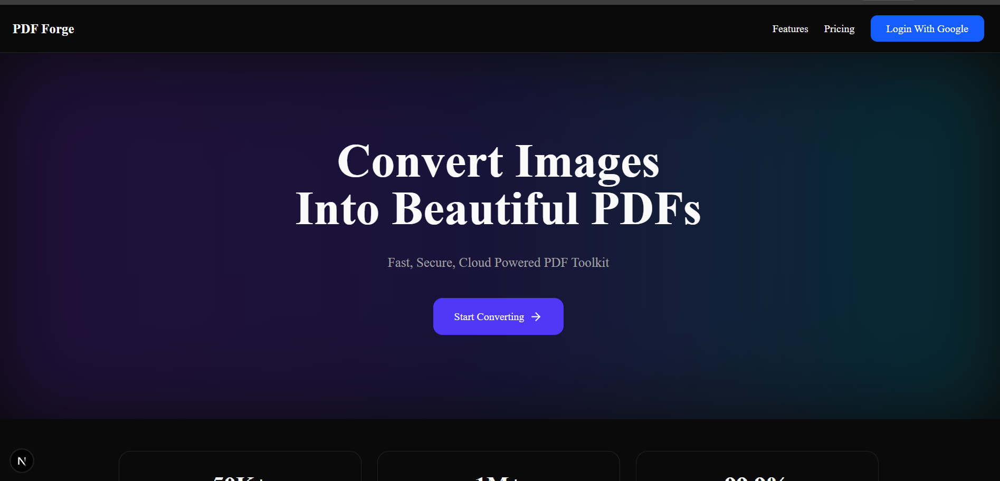
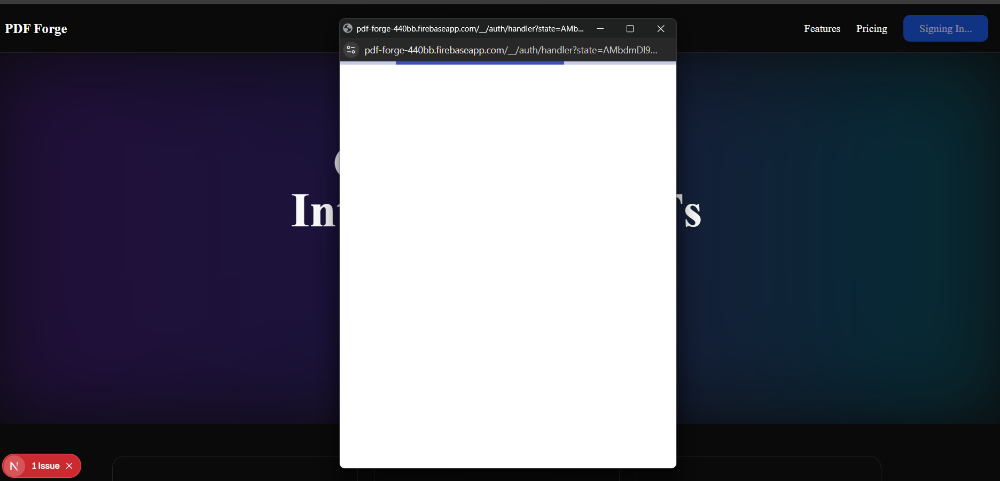
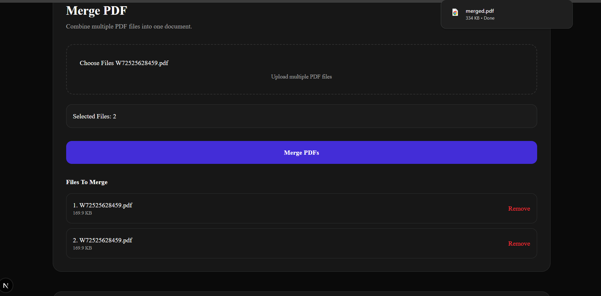
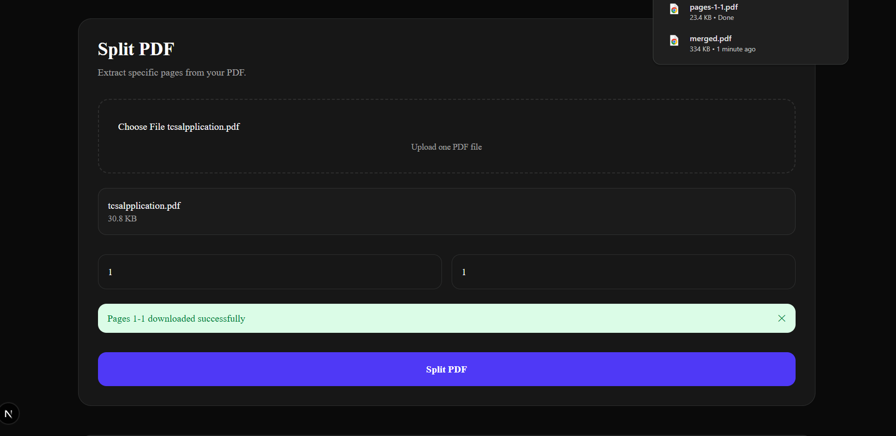
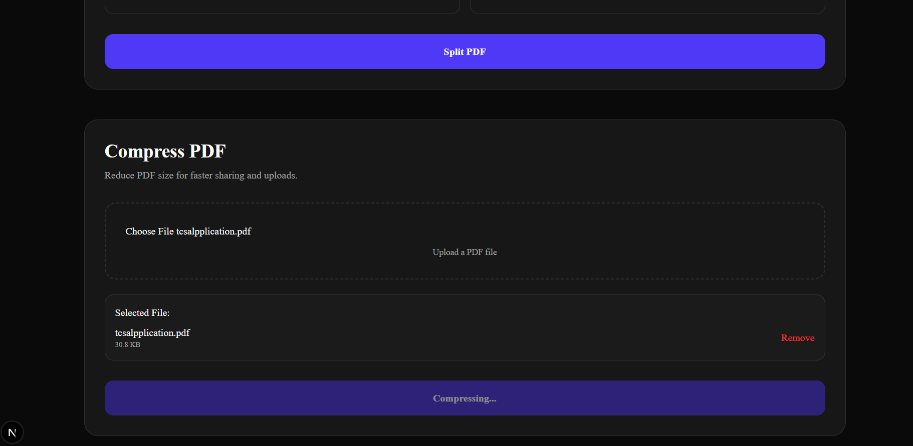
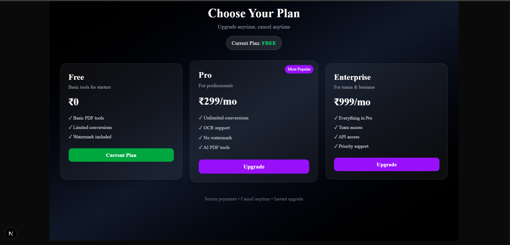

# 📄 PDF Forge – SaaS PDF Toolkit

A modern, full-stack **PDF Management Platform** built with **Next.js, TypeScript, Tailwind CSS, Firebase Authentication, Cloudinary, and PDF processing libraries**.

PDF Forge provides an intuitive interface for uploading, converting, compressing, merging, and splitting PDF files while delivering a clean SaaS-style user experience.

---

# 🚀 Live Demo

🔗 **Live Streaming At:**  
https://pdf-forge-s8iw.vercel.app/

---

# 📸 Screenshots

## 🏠 Home Page



---

## 🔐 Firebase Authentication



---

## 📑 Merge PDF



---

## ✂️ Split PDF



---

## 🗜️ Compress PDF



---

## ✅ File Validation



---

# ✨ Features

### 📂 PDF Upload

- Drag & Drop Upload
- Secure Cloud Upload
- File Validation
- Progress Indicator

### 📄 PDF Tools

- Merge PDFs
- Split PDFs
- Compress PDFs
- Download Processed PDFs
- Secure File Storage

### 🔐 Authentication

- Firebase Authentication
- Google Sign In
- Protected Dashboard
- User Session Management

### ☁️ Cloud Storage

- Cloudinary Integration
- Fast File Uploads
- Secure Storage
- Optimized File Delivery

### 🎨 Modern UI

- Fully Responsive Design
- Dark Mode
- Smooth Animations
- Professional SaaS Layout
- Mobile Friendly

---

# ⚙️ Tech Stack

## Frontend

- Next.js 16
- React 19
- TypeScript
- Tailwind CSS

## Authentication

- Firebase Authentication

## Cloud Storage

- Cloudinary

## PDF Processing

- pdf-lib

## Deployment

- Vercel

---

# 📂 Project Structure

```text
app/
components/
lib/
public/
│
└── screenshots/
    ├── home.png
    ├── firebaseauth.png
    ├── merge.png
    ├── split.png
    ├── compress.png
    └── validity.png
```

---

# 🛠 Installation

Clone the repository

```bash
git clone https://github.com/thanmai2903/pdf-forge.git
```

Move into the project

```bash
cd pdf-forge
```

Install dependencies

```bash
npm install
```

Create a `.env.local` file

```env
NEXT_PUBLIC_FIREBASE_API_KEY=

NEXT_PUBLIC_FIREBASE_AUTH_DOMAIN=

NEXT_PUBLIC_FIREBASE_PROJECT_ID=

NEXT_PUBLIC_FIREBASE_STORAGE_BUCKET=

NEXT_PUBLIC_FIREBASE_MESSAGING_SENDER_ID=

NEXT_PUBLIC_FIREBASE_APP_ID=

CLOUDINARY_CLOUD_NAME=

CLOUDINARY_API_KEY=

CLOUDINARY_API_SECRET=
```

Run the application

```bash
npm run dev
```

Open

```
http://localhost:3000
```

---

# 💡 Key Highlights

- Secure PDF Upload
- Firebase Authentication
- Cloudinary Integration
- Responsive UI
- SaaS Inspired Dashboard
- TypeScript Support
- Dark Mode
- Fast Performance
- Mobile Responsive

---

# 📚 What I Learned

During this project I strengthened my skills in:

- Next.js App Router
- TypeScript
- Firebase Authentication
- Cloudinary Integration
- File Upload Handling
- PDF Processing
- Environment Variables
- Responsive UI Design
- Component Architecture
- SaaS Application Development
- Deployment with Vercel

---

# 🚀 Future Improvements

- OCR (Image to Text)
- AI PDF Summarization
- AI Document Chat
- PDF Password Protection
- Watermark Removal
- PDF Annotation
- Subscription Plans
- Razorpay Integration
- Stripe Integration
- Team Workspace
- Usage Analytics

---

# 🤝 Contributing

Contributions, issues, and feature requests are welcome.

Feel free to fork this repository and submit a pull request.

---

# 📄 License

This project is licensed under the MIT License.

---

## 👨‍💻 Developer

**Thanmai Palla**

If you found this project helpful, don't forget to ⭐ the repository!
